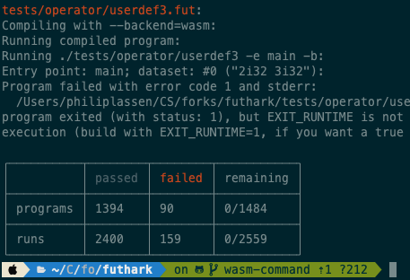

# Progress

I implmemented data input and output through temporary files as we discussed last week, as a solution for the binary input/output problems. This fixed the lion's share of the test cases that were not passing. The other change I made to pass more tests, was including the `-s ALLOW_MEMORY_GROWTH=1` flag to the Emscripten compiler. According to the documentation this has little to no overhead for Web Assembly. The code can be seen on the following [branch](https://github.com/diku-dk/futhark/tree/wasm)

## Running test suite

Running 
```bash
futhark test tests/ --backend=wasm --runner=node --no-tuning
```
Giving the following

```
tests/big0.fut:
Compiling with --backend=wasm:
Running compiled program:
Running ./tests/big0 -e main -b:
Entry point: main; dataset: #0 ("2i64 1100000000i64 1i32 1073741823i32"):
Program failed with error code -10 and stderr:

Entry point: main; dataset: #1 ("3i64 1073741824i64 2i32 1073741823i32"):
Program failed with error code -10 and stderr:

┌──────────┬────────┬────────┬───────────┐
tests/futlib_tests/array.fut:
Compiling with --backend=wasm:
Running compiled program:
Running ./tests/futlib_tests/array -e test_tail -b:
Entry point: test_tail; dataset: #0 ("empty([0]bool)"):
Expected error:
  Error
Got error:

Running ./tests/futlib_tests/array -e test_init -b:
Entry point: test_init; dataset: #0 ("empty([0]bool)"):
Expected error:
  Error
Got error:

tests/primitive/ctz.fut:
Compiling with --backend=wasm:
Running compiled program:
Running ./tests/primitive/ctz -e ctzi64 -b:
Entry point: ctzi64; dataset: #0 ("[0i64, -1i64, -9223372036854775808i64]"):
tests/primitive/ctz.fut.ctzi64.0.actual and tests/primitive/ctz.fut.ctzi64.0.expected do not match:
Value (0,2) expected 63i32, got 32i32

tests/big2.fut:
Compiling with --backend=wasm:
Running compiled program:
Running ./tests/big2 -e main -b:
Entry point: main; dataset: #0 ("2147483748i64"):
Program failed with error code -10 and stderr:

tests/slice1.fut:
Compiling with --backend=wasm:
Running compiled program:
Running ./tests/slice1 -e main -b:
Entry point: main; dataset: #3 ("[[1i32, 2i32, 3i32], [4i32, 5i32, 6i32]] 1i32 0i32"):
Expected error:
  Index \[0:2, 1:0\] out of bounds for array of shape \[2\]\[3\].
Got error:
  /Users/philiplassen/CS/forks/upstream/futhark/tests/slice1: Error: Index [4699sc22565345856327781msc4699(null)-4294962595sc4738c20375324856965(null)

Backtrace:
stdio streams had content in them that was not flushed. you should set EXIT_RUNTIME to 1 (see the FAQ), or make sure to emit a newline when you printf etc.
program exited (with status: 1), but EXIT_RUNTIME is not set, so halting execution but not exiting the runtime or preventing further async execution (build with EXIT_RUNTIME=1, if you want a true shutdown)

tests/inplace4.fut:
Compiling with --backend=wasm:
Running compiled program:
Running ./tests/inplace4 -e main -b:
Entry point: main; dataset: #1 ("[42i32, 42i32] [0i32, 1i32, 2i32, 3i32, 4i32]"):
Expected error:
  inplace4.fut:9
Got error:

┌──────────┬────────┬────────┬───────────┐
│          │ passed │ failed │ remaining │
├──────────┼────────┼────────┼───────────┤
│ programs │ 1479   │ 6      │ 0/1485    │
├──────────┼────────┼────────┼───────────┤
│ runs     │ 2552   │ 8      │ 0/2560    │
└──────────┴────────┴────────┴───────────┘
```



# Issues

Test errors seem to fall into the following two categories
- A few error test cases don't have compatible errors to that which is expected. 
- Code seems to break on very big numbers (Likely the lack of int64 support in WASM we breifly discussed a few weeks ago.)

Other minor issue
- On panic exit, temp files don't get deleted (This should not be hard to fix)

# Next Steps

- What needs to be done to get this merged into Futhark?
- Should I start working on MultiCore?


